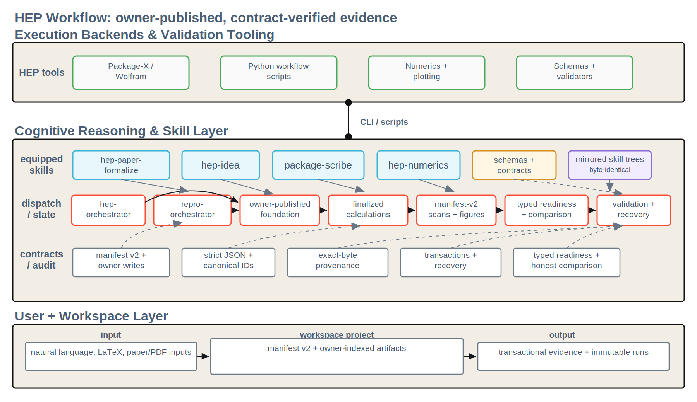

# hep-workflow

> A skill-based agent workflow for high-energy physics phenomenology:
> from model proposal through symbolic calculation to numerical scans
> and publication-oriented exclusion plots.

## What this is for

`hep-workflow` is a contract-tested scaffold for agent-assisted HEP
phenomenology. It is designed for workflows where the important outputs are
auditable project artifacts, not hidden notebook state or one-off chat
transcripts.

Use it when you want to:

1. Turn a BSM idea or Lagrangian into canonical model, calculation, constraint,
   and benchmark artifacts.
2. Derive symbolic observables with explicit provenance, Package-X /
   Mathematica code, and Python translations.
3. Run reproducible numerical scans with constraint overlays, figures, and
   analysis summaries.
4. Import a published paper into separate literature and reproduction artifacts,
   compare against reference data mechanically, and keep paper formulas separate
   from computational backends. An explicitly authorized literature fallback is
   exploratory only and cannot support an honest reproduction verdict.

`hep-workflow` provides two coordinated workflow surfaces:

- A model-first HEP workflow: `hep-idea` -> `package-scribe` -> `hep-numerics`.
- A paper-reproduction workflow: `hep-paper-formalize` plus mechanical
  comparison through `scripts/compare_to_reference.py`.

## Quick start

### 1. Install

Use Python 3.11 or newer. A virtual environment is recommended; mixed system
scientific Python environments can fail for reasons unrelated to this project.

```bash
git clone https://github.com/huangzhonglv/hep-workflow.git
cd hep-workflow
python3 -m venv .venv
source .venv/bin/activate
python3 -m pip install --upgrade pip
python3 -m pip install -r requirements-dev.txt
```

Optional Wolfram dependency: the default validators and test suite do not
require Wolfram. To execute Package-X calculations or run the gated end-to-end
tests, install Mathematica or Wolfram Engine, make sure the `wolframscript`
command works in your terminal, and ensure Package-X can be loaded by Wolfram.

### 2. Run the validators

```bash
python3 scripts/sync_skill_mirrors.py --check
python3 scripts/validate_examples.py
python3 scripts/validate_workspace_projects.py
python3 -m pytest -q
```

The first command is a read-only mirror precondition; the following three are
the core semantic validation layers. If all four return exit code 0, your
checkout satisfies the repository's mirror, schema, fixture, and test
contracts.

With the development environment active, `make validate` runs the same three
commands. Use `make test`, `make contract`, or `make e2e` for the corresponding
focused flow.

The end-to-end tests are gated because they may require `wolframscript`:

```bash
python3 -m pytest -q tests/e2e --run-e2e
```

### 3. Explore an example project

```bash
ls workspace/projects/smoke-e2e/
ls workspace/projects/smoke-e2e/model/
```

The repository commits only this minimal workspace fixture under
`workspace/projects/`. Other workspace projects are user-local generated state
and are not part of the public release.

## Skills and Agents

| Skill | Role | Key entry point |
| --- | --- | --- |
| [`hep-idea`](./.claude/skills/hep-idea/SKILL.md) | Model and constraint artifact generation, including revisions | Triggered by "define a new model", "add constraint", "update model" |
| [`hep-paper-formalize`](./.claude/skills/hep-paper-formalize/SKILL.md) | Paper metadata, extraction, reproduction targets, and paper-first model formalization | Triggered by "reproduce paper", "replicate Fig.", "import paper" |
| [`package-scribe`](./.claude/skills/package-scribe/SKILL.md) | Symbolic calculation: Mathematica and Python with benchmark verification | Triggered by "compute the analytical expression for ..." |
| [`hep-numerics`](./.claude/skills/hep-numerics/SKILL.md) | Parameter scans, constraint evaluation, figures, analysis summaries | Triggered by "run a scan", "make an exclusion plot", "rerun analysis" |

| Agent | Role | Key entry point |
| --- | --- | --- |
| [`hep-orchestrator`](./.claude/agents/hep-orchestrator.md) | Reads model-first project state, dispatches documented writers, and validates owner-published outputs | Triggered by "start a new project", "run the full pipeline", "continue my project", "project status" |
| [`repro-orchestrator`](./.claude/agents/repro-orchestrator.md) | Routes typed reproduction prerequisites, invokes the mechanical comparator, and validates owner-published immutable runs | Triggered by "reproduce paper", "replicate Fig.", "arXiv paper", "reproduction status" |

Codex-format agent definitions live under [`.codex/agents/`](./.codex/agents/).
Skill definitions are mirrored under [`.claude/skills/`](./.claude/skills/) and
[`.agents/skills/`](./.agents/skills/); mirror invariants are contract-tested.

### Using these definitions with Codex or Claude

This repository does not provide a standalone command-line runner for agents or
skills. Use the definitions from an agent-capable environment:

- **Claude Code**: open this repository as the working directory. Claude Code
  reads `CLAUDE.md`, [`.claude/agents/`](./.claude/agents/), and
  [`.claude/skills/`](./.claude/skills/).
- **Codex**: open this repository as the working directory. Codex reads
  `AGENTS.md`, discovers repository skills under
  [`.agents/skills/`](./.agents/skills/), and makes the project-scoped custom
  agents in [`.codex/agents/`](./.codex/agents/) available for delegation.

Then ask for a workflow in natural language, for example:

```text
use hep-orchestrator to start a new project
run package-scribe on task-001
run hep-numerics
use repro-orchestrator to reproduce Fig. 3 of an arXiv paper
```

Direct requests can invoke a matching skill. Coordinated workflows can delegate
to `hep-orchestrator` or `repro-orchestrator`, which dispatch the documented
skill or script owners and validate the resulting workspace artifacts.

## Architecture

The workflow separates LLM-driven orchestration and artifact generation from
deterministic scripts, schemas, and validators. Skill trees are byte-identical
between Claude and Codex installations; agent definitions use platform-specific
formats but remain content-equivalent. Agents read and route project state;
documented skill or script owners publish scoped manifest changes, and callers
validate those publications. New calculation, scan, and reproduction outputs
carry exact-byte dependency graphs that consumers independently verify; see the
[content-addressed dependency contract](./docs/contracts/content-addressed-dependencies.md).



## Current guarantees and limits

The current release enforces these workflow properties:

- **Fail-closed inputs.** Repository-controlled JSON trust boundaries reject
  duplicate keys, invalid UTF-8, `NaN` / `Infinity`, and finite-looking numeric
  overflow before publishing state. See the
  [strict JSON contract](./docs/contracts/strict-json.md).
- **Owner-published state.** Manifest write authority is narrow: foundation
  skills author owner-scoped private candidates, mechanical finalizers publish
  them, scripts own derived projections, and orchestrators dispatch and verify
  rather than performing a second merge. Multi-path writers use lock, journal,
  compare-and-swap, and manifest-last publication. Load-bearing model/task/
  benchmark changes preserve prior calculation evidence as explicitly `stale`,
  and upstream publication derives affected numerics staleness in the same
  generation; legacy numerics transitions use the explicit
  `scripts/refresh_numerics_staleness.py` repair. See the
  [layer-ownership](./docs/contracts/skill-agent-division.md) and
  [transactional-publication](./docs/contracts/transactional-state-publication.md)
  contracts.
- **Reproducible numerics.** Manifest version 2 owns evidence and exact
  dependencies per analysis. Scans use the versioned `pcg64-v1` local RNG
  contract, figures bind `figures.meta.json`, and higher-dimensional plots and
  comparisons accept only an explicitly fixed exact slice. See the
  [numerics ownership contract](./docs/contracts/numerics-manifest-ownership.md)
  and [scan-config reference](./.claude/skills/hep-numerics/references/scan-config-json-contract.md).
- **Typed reproduction routing.** Readiness is a deterministic read-only
  projection of current evidence; manifest status and history are routing hints,
  not proof. Formula targets do not consume ambient model, calculation, or scan
  state. See the
  [reproduction-readiness contract](./docs/contracts/reproduction-readiness.md).
- **Honest comparison.** Missing, partial, stale, non-finite, ambiguous, or
  insufficiently independent evidence cannot become a pass. Tolerances and
  comparison coverage are declared before results, and completed reproduction
  runs are immutable. See the
  [honest reproduction principle](./docs/contracts/honest-reproduction-principle.md).

Supported numeric target kinds are `benchmark_point` (exactly one reference
row), `keyed_benchmark_set` (multi-row keyed comparison), `scan_table`,
single-valued `figure_curve`, ordered `parametric_curve`, and
`exclusion_region`. Tables and keyed sets require full declared coverage;
exclusion boundaries require an explicit authoritative source and disconnected
or holed regions require declared `reference_faces`. Constraint-verdict
transition geometry remains blocked until it can be assembled into unambiguous
ordered paths. Full field-level semantics live in the
[reproduction-target reference](./.claude/skills/hep-paper-formalize/references/repro-targets-contract.md).

Quantitative reference import keeps three distinct evidence files: the raw
source table, a canonical-unit table, and a hash-bound machine-verifiable
normalization record. The comparator verifies that transformation and accepts
already canonical data; it never guesses units or converts scan output.

Two portability limits remain explicit. Exact-byte provenance does not attest
the Python/Wolfram runtime, installed native libraries, OS, or CPU.
Transactional durability is qualified only for supported POSIX hosts on a
regular local same-filesystem workspace; Windows, NFS, SMB, object-backed
mounts, and cross-device publication are not currently supported.

## Workspace project layout

```text
workspace/projects/<project-name>/
|-- manifest.json              # v2 project state and owner-indexed artifacts
|-- idea/                      # research proposal artifacts
|-- model/                     # model spec, calc tasks, benchmarks
|-- constraints/               # experimental constraint data
|-- calculations/task-001/     # symbolic and Python results per task
|-- literature/                # optional paper reproduction inputs
|-- reproduction/
|   |-- runs/<repro-id>/       # immutable result + provenance snapshot
|   |-- figures/<repro-id>/
|   `-- reports/<repro-id>.md
`-- numerics/
    |-- scan-configs/<analysis-id>.json
    |-- scan-results/<analysis-id>/  # scan.csv + scan.meta.json
    |-- figures/<analysis-id>/       # outputs + figures.meta.json
    `-- analysis-summary-<analysis-id>.md
```

A minimal hand-checkable example lives at `workspace/projects/smoke-e2e/` and
is used by the end-to-end smoke suite. Richer synthetic contract fixtures for
tests live under `tests/fixtures/workspace-projects/`; they are not user
workspace state. Detailed output contracts, e2e gating, and `wolframscript`
requirements live in [CONTRIBUTING.md](./CONTRIBUTING.md).

## Contracts

The load-bearing contracts live under [docs/contracts/](./docs/contracts/).
JSON Schemas define machine-validated artifact shapes. The Markdown contracts
capture repository-level invariants that are not fully expressible as schemas,
such as mirror invariants, source-of-truth order, and honest reproduction rules.
When documentation disagrees, fix top-down from schemas and contracts rather
than treating README prose as the source of truth.

The summaries above are discovery aids. Follow the linked contracts and schemas
for field-level behavior, migration, recovery, and platform qualification.

## Documentation

- **For users**: each skill's `SKILL.md` documents how it is invoked and what
  it produces.
- **For contributors**: see [CONTRIBUTING.md](./CONTRIBUTING.md) for
  development setup, test discipline, and how to add new skills, tests, or
  history actions.
- **For agents reading this repository**: see [AGENTS.md](./AGENTS.md) or
  [CLAUDE.md](./CLAUDE.md); they are kept byte-identical.

## Acknowledgements

We thank Chia-Wei Liu, Yu-Qi Xiao, and Xin-Yuan Gao for helpful discussions.

## License

[MIT](./LICENSE)
